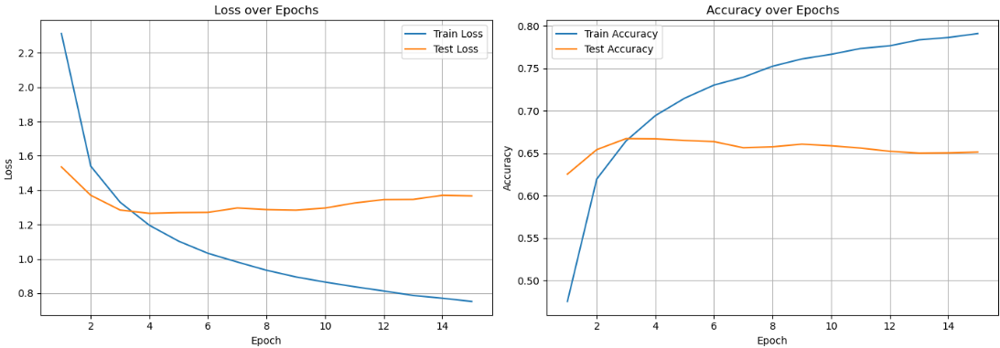
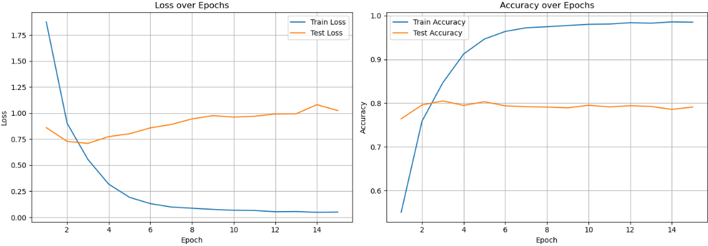
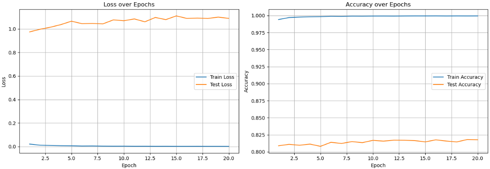

# Experiment Log — Foodify101

This log summarizes the training phases, settings, and results for the Foodify101 model built using ResNet50 and progressive fine-tuning.

| Phase    | Layers Trained           | Learning Rate(s)                  | Epochs | Scheduler               | Final Test Accuracy | Notes                                  |
|----------|--------------------------|-----------------------------------|--------|--------------------------|---------------------|----------------------------------------|
| Phase 1  | `fc` only                | `1e-3`                            | 15     | None                     | ~65%                | Trained only the final classification layer |
| Phase 2  | `layer4`, `fc`           | `1e-4`                            | 15     | None                     | ~79%                | Introduced dropout before final layer |
| Phase 3  | `layer3`, `layer4`, `fc` | `1e-6` / `1e-5` / `1e-4`          | 20     | `StepLR (γ=0.5, step=5)` | **~82%**           | Layer-specific fine-tuning for final boost |

> All experiments were trained on an NVIDIA RTX 4070 Super with 12GB VRAM.

## Phase 1 - Loss and Accuracy Curves

## Phase 2 - Loss and Accuracy Curves

## Phase 3 - Loss and Accuracy Curves

